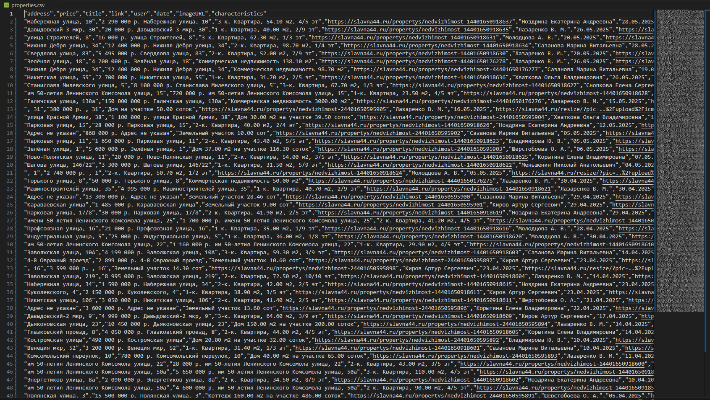

# Парсинг сайта

Этот проект представляет собой веб-скрапер, написанный на JavaScript с использованием Node.js и нескольких библиотек, таких как Axios, Cheerio, JSON2CSV и Puppeteer. Скрапер извлекает информацию о недвижимости с веб-сайта 
 [slavna44](https://slavna44.ru/propertys?page=1) и сохраняет ее в формате CSV.

## Загрузка Node.js

Чтобы начать работать с проектом необходимо скачать [Node.js](https://nodejs.org/en) 

### Инициализация проекта

```sh
npm init
```

### Установка зависимостей

```sh
npm install axios cheerio json2csv fs puppeteer
```

### Запуск проекта

```sh
node script
```

## Результат



## Лицензия
[MIT](https://opensource.org/license/mit/) Copyright (c) 2024 - forever Azer5555
